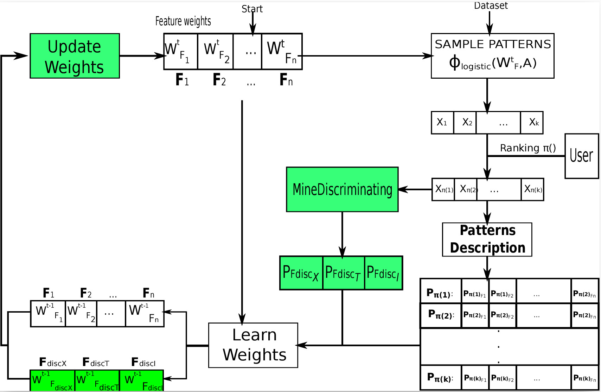

# Discriminating Sub-Pattern features Learning (DiSPaLe) from user preferences

This repository contains the implementation of DiSPaLe, our interactive mining approach 
that was published at [PAKDD-2023](https://link.springer.com/chapter/10.1007/978-3-031-33374-3_20). 
In this paper, we propose a new interactive pattern mining approach that introduces more 
complex class of descriptors for *explainable ranking*, thereby allowing to capture the 
importance of item interactions. These descriptors exploit the concept of **discriminating sub-patterns**, 
which separate patterns that are given low rank by the user from those with high rank. 
By temporarily adding those descriptors, we can learn weights for them, which are 
then apportioned to involved items without blowing up the feature space. 
Results on [UCI](https://archive.ics.uci.edu/datasets) and [CP4IM](https://dtai.cs.kuleuven.be/CP4IM/datasets/) datasets show favourable trade-offs in quality-time of learning.

## 1- Discriminating features
Discriminating patterns are correlated with the user's ranking and can therefore be used to explain it.
The figure below provides a schematic overview of how DiSPaLe operates.


The paper's supplementary materials can be found in the ['paper'](https://gitlab.com/phdhien/dispale/-/tree/main/paper?ref_type=heads) directory.
A tutorial and an illustrative example of discriminating features are also included.


## 2- Compiling the project
Before executing, you must first compile the project.

To do this, navigate to the project's root directory and run the **build-code.py** Python script.

**Check the parameters to be used with _build-code.py_**
```
python build-code.py -h
```

**Compile the project and generate the _.jar_ files required for the execution**
```
python build-code.py -b
```
If previously created _.jar_ files existed, the compilation command may fail.
In this case, you must force the project to compile using: 
```
python build-code.py -fb
```

**Clean the previously built project using the _clean_ parameter**
```
> python build-code.py -c
```

If everything went well, you will receive an exit status of 0.
Otherwise, you must check the log file in the _results_ directory.


## 2- Execution
The program has been implemented using Java, Scala, and Python. The executable files generated are JAR files.
Executions can be carried out using the **[test-program.py](https://gitlab.com/phdhien/dispale/-/blob/main/scripts/test-program.py?ref_type=heads)** Python script.

You can find bellow some examples commands:

For help with the parameters:
```
> python scripts/test-program.py -h
```

Launch **DiSPaLe** using the following parameters: 
* _chess_ dataset with a frequency threshold of 0.5 (50% of the transactions in the dataset),
* queries size equal to 5
* 10 iterations loops
* _Flexics_ sampler as the oracle, _Eflexics_ as the oracle algorithm 
* _Items_ as features 
* [rankSVM](https://www.cs.cornell.edu/people/tj/svm_light/svm_rank.html) to update the features weights during user preferences learning
* 0 as the quey retention value
* a timeout of 10 secondes
```
python scripts/test-program.py -m dispale -d chess -f 0.5 -k 5 -i 10 -o flexics -a eflexics -F Items -l 0 -to 100
```

Launch [letsip](https://bitbucket.org/wxd/letsip/src/master/) using the following parameters: 
* _german-credit_ dataset with a frequency threshold of 0.25 (25% of the transactions in the dataset),
* queries size equal to 10
* 25 iterations loops
* _Flexics_ sampler as the oracle, _Eflexics_ as the oracle algorithm 
* a combination of _Items_, _Transactions_ and _Length_ as features 
* _SCD (Stochastic Coordinate Descent)_ to update the features weights during user preferences learning
* 1 as the quey retention value
* a timeout of 10 minutes
```
> python3 scripts/test-program.py -m 'letsip' -d german-credit -f 0.25 -k 10 -o flexics -a eflexics -F Items-Transactions-Length -l 1 -i 25 -to 600
```

We recently propose at [EGC-2024](https://editions-rnti.fr/?inprocid=1002929) a method for interactive mining of High Utility Itemsets (HUI). This method is denoted **LUTOM**.

Launch lutom on *mushroom* dataset setting queries size equal to 3, 
*huiminer* as the oracle, the [*tkuce*](https://link.springer.com/chapter/10.1007/978-3-030-55789-8_72) algorithm, 
*Items-Transactions* as features, 0 as the quey retention value and 12 iterations loops:
```
> python3 scripts/test-program.py -m 'lutom' -d 'mushroom' -k 3 -o 'huiminer' -a 'tkuce' -F 'Items-Transactions' -l 0 -i 12
```

Launch lutom++Discriminating patterns on *hepatitis* dataset setting queries size equal to 7, 
*huiminer* as the oracle *huiminer* as the oracle, the [*haisampler*](https://link.springer.com/chapter/10.1007/978-3-031-05936-0_11) algorithm, *Items* as features, 
2 as the quey retention value and 12 iterations loops:
```
> python3 scripts/test-program.py -m 'lutomDisc' -d 'hepatitis' -k 7 -o 'huiminer' -a 'haisampler' -F 'Items' -l 2 -i 12
```


